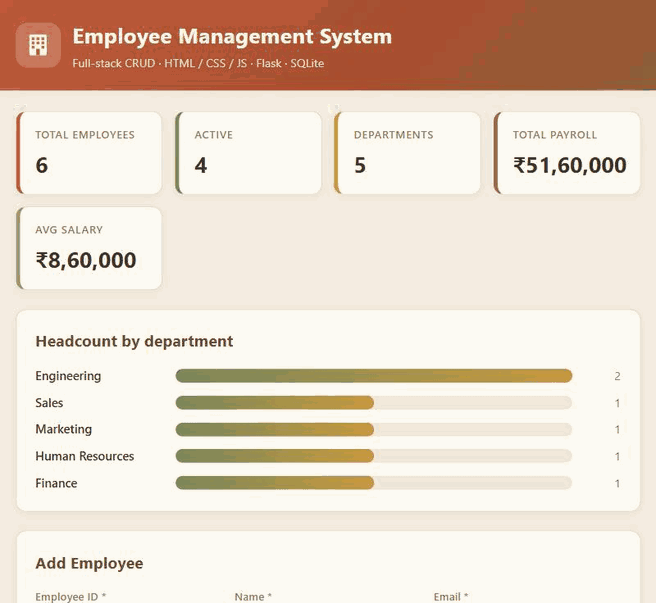

# Employee Management System (Aim 5)

A full-stack CRUD web app for managing employee records, extended well beyond the
base objective into a small HR dashboard.



> 📺 **[Watch the full-resolution demo (1000px, ~20 MB GIF)](https://raw.githubusercontent.com/24pardikara/employee-management-system/main/docs/demo-hd.gif)**

- **Frontend:** HTML, CSS, vanilla JavaScript (with Node.js tooling for a dev server)
- **Backend:** Python Flask REST API (app-factory pattern)
- **Database:** SQLite
- **Tests:** pytest (30 API tests)

## Features

Core CRUD (the objective):
- Add, view/list, search, update and delete employee records
- Fields: Name, Employee ID, Email, Department, Designation, Salary, Contact, Status, Date Joined
- Search by Employee ID, Name, Department, or all fields
- Dynamic rendering with **no page reloads** (fetch + JSON)
- Input validation on **both** client and server (unique Employee ID, valid salary/email, etc.)
- Correct handling of duplicate IDs (HTTP 409) and deleting non-existent employees (HTTP 404)

Beyond the objective:
- **Dashboard** — live stat cards (total, active, departments, total payroll, average salary)
- **Headcount-by-department** bar breakdown
- **Filters** — by status (Active / On Leave / Inactive) and by department
- **Sortable columns** — click any header to sort ascending/descending (server-side, SQL-injection-safe)
- **CSV export** — downloads the current filtered view
- **Employee status** pills and join dates
- Light, earthy UI theme
- 27 pytest tests covering CRUD, validation, search, filters, sorting, stats, and export

## Project layout

```
MDM/
├── backend/
│   ├── app.py            # Flask app: REST API + serves the frontend
│   ├── requirements.txt
│   └── employees.db      # created automatically on first run
├── frontend/
│   ├── index.html
│   ├── style.css
│   ├── app.js
│   └── package.json      # Node dev-server tooling (optional)
└── README.md
```

## Database schema (normalized)

The data is stored in a **normalized** 3-table structure rather than one flat
table, so department and designation values are never duplicated across rows:

```
departments                designations
  id    (PK)                 id     (PK)
  name  (UNIQUE)             title  (UNIQUE)
        ▲                           ▲
        │ department_id             │ designation_id
        └───────────┐   ┌───────────┘
                 employees
                   id             (PK)
                   emp_id         (UNIQUE)
                   name, email, salary, contact, status, date_joined
                   department_id  (FK → departments.id)
                   designation_id (FK → designations.id)
```

New departments/designations are created on demand (get-or-create) when adding
or updating an employee. The JSON API still returns `department` and `designation`
as readable names (via a JOIN), so clients never deal with raw ids.

## REST API

| Method | Endpoint                   | Purpose                                      |
|--------|----------------------------|----------------------------------------------|
| GET    | `/api/employees`           | List/search/filter/sort                      |
| GET    | `/api/employees/<emp_id>`  | Get one employee                             |
| POST   | `/api/employees`           | Add an employee                              |
| PUT    | `/api/employees/<emp_id>`  | Update an employee                           |
| DELETE | `/api/employees/<emp_id>`  | Delete an employee                           |
| GET    | `/api/employees/export`    | Download current view as CSV                 |
| GET    | `/api/departments`         | Distinct department list                     |
| GET    | `/api/stats`               | Dashboard metrics                            |

Query params for the list/export endpoints:
- `q` + `field` (`id` / `name` / `department` / `all`) — search
- `status` (`Active` / `On Leave` / `Inactive`) — filter
- `department` — filter
- `sort` (`emp_id`, `name`, `department`, `designation`, `salary`, `status`, `date_joined`) + `order` (`asc` / `desc`)

## Setup & run

### 1. Backend (required)

```bash
cd backend
python -m venv venv
venv\Scripts\activate          # Windows PowerShell: venv\Scripts\Activate.ps1
pip install -r requirements.txt
python app.py
```

Then open **http://127.0.0.1:5000** — Flask serves both the API and the frontend,
so this alone runs the whole app.

### 2. Frontend via Node tooling (optional)

If you want the Node-based live-reload dev server on its own port:

```bash
cd frontend
npm install
npm run dev        # serves on http://127.0.0.1:3000
```

Keep the Flask backend running too; `app.js` auto-targets `http://127.0.0.1:5000/api`
with CORS enabled, so the two servers talk to each other.

### 3. Run the tests

```bash
cd backend
pip install -r requirements.txt
pytest -v
```

The suite uses isolated temporary databases, so it never touches `employees.db`.

## Seed data

On first run the database is seeded with four sample employees so the table
isn't empty. Delete `backend/employees.db` to start fresh.

## Testing the edge cases

- **Duplicate ID:** add an employee with an existing `emp_id` → server returns 409 and the UI shows the error.
- **Delete non-existent:** `DELETE /api/employees/NOPE` → 404 with a clear message.
- **Invalid salary:** enter text in Salary → blocked client-side and server-side.
